# 🔄 Complete Workflow: Local JSON → OpenAI → Local Storage

## 📊 Workflow Overview

```mermaid
graph TD
    A[📁 Local JSON File<br/>sample_user_profile.json] --> B[🔍 Load & Validate]
    B --> C[🌐 Send to Django API<br/>POST /plan/api/career-plans/generate_plan/]
    C --> D[🤖 OpenAI GPT-3.5-turbo<br/>Process User Data]
    D --> E[✅ AI Response<br/>Structured Career Plan]
    E --> F[💾 Save to Database<br/>CareerPlan Model]
    E --> G[📁 Save to Local File<br/>downloads/ folder]
    F --> H[📝 Log Request<br/>AIRequestLog Model]
    G --> I[📤 Return Response<br/>JSON with file path]
    
    style A fill:#e1f5fe
    style D fill:#fff3e0
    style E fill:#e8f5e8
    style G fill:#f3e5f5
    style I fill:#e8f5e8
```



## 🔄 Detailed Step-by-Step Process

### **Step 1: Input - Local JSON File**
```
📁 File: sample_user_profile.json
├── user_profiles: [Array of user data]
│   ├── name, email, age, gender
│   ├── title, education, experience
│   ├── personality_traits, motivators
│   └── work_style, user_type
└── user_prompt: "I want to transition into AI Product Manager..."
```

### **Step 2: API Request Processing**
```python
# 1. Load JSON file
with open('sample_user_profile.json', 'r') as f:
    user_data = json.load(f)

# 2. Send to Django API
response = requests.post(
    'http://localhost:8000/plan/api/career-plans/generate_plan/',
    json=user_data
)
```

### **Step 3: Django Backend Processing**
```python
# 1. Validate input data
request_serializer = CareerPlanRequestSerializer(data=request.data)

# 2. Create/update user profile in database
user_profile, created = UserProfile.objects.get_or_create(
    email=user_profile_data['email'],
    defaults=user_profile_data
)

# 3. Call OpenAI service
ai_result = self.ai_service.generate_career_plan(user_profile, user_prompt)
```

### **Step 4: OpenAI Integration**
```python
# 1. Prepare user message for AI
user_message = self._prepare_user_message(user_profile, user_prompt)

# 2. Call OpenAI API
response = self.client.chat.completions.create(
    model='gpt-3.5-turbo',
    messages=[
        {"role": "system", "content": system_prompt},
        {"role": "user", "content": user_message}
    ],
    max_tokens=4000,
    temperature=0.7,
    response_format={"type": "json_object"}
)

# 3. Extract and validate response
plan_data = json.loads(response.choices[0].message.content)
self._validate_plan_response(plan_data)
```

### **Step 5: Response Processing**
```python
# 1. Create career plan in database
career_plan = CareerPlan.objects.create(
    user_profile=user_profile,
    goal_id=plan_data['goal_id'],
    plan_description=plan_data['plan_description'],
    blockers=plan_data['blockers'],
    milestones=plan_data['milestones'],
    weekly_plans=plan_data['weekly_plans'],
    ai_model_used='gpt-3.5-turbo',
    tokens_used=tokens_used,
    processing_time=processing_time
)

# 2. Save to local file
filename = f"career_plan_{user_profile.name}_{timestamp}.json"
file_path = self.storage_service.save_response_to_file(plan_data, filename)

# 3. Log the request
AIRequestLog.objects.create(
    user_profile=user_profile,
    request_type='plan_generation',
    input_data=input_data,
    output_data=plan_data,
    status='success'
)
```

### **Step 6: Output - Local Storage**
```
📁 downloads/
├── career_plan_Sarah_Johnson_20241201_143022.json
│   ├── goal_id: "550e8400-e29b-41d4-a716-446655440000"
│   ├── plan_description: "Comprehensive 3-month plan..."
│   ├── blockers: ["Limited AI/ML knowledge", ...]
│   ├── milestones: [4 structured milestones]
│   └── weekly_plans: [12 weekly breakdowns]
└── ai_request_logs_20241201_143022.json
    ├── request_type: "plan_generation"
    ├── processing_time: 2.5
    ├── tokens_used: 1500
    └── status: "success"
```

## 🛠️ Key Components

### **1. Input Handler (views.py)**
- Validates JSON structure
- Creates/updates user profiles
- Manages database transactions

### **2. AI Service (services.py)**
- Formats user data for OpenAI
- Calls GPT-3.5-turbo API
- Validates AI response structure
- Handles errors gracefully

### **3. Storage Service (services.py)**
- Saves responses to local files
- Generates timestamped filenames
- Manages downloads directory

### **4. Database Models**
- **UserProfile**: Stores user information
- **CareerPlan**: Stores AI-generated plans
- **AIRequestLog**: Tracks all AI requests

## 📋 API Endpoints

### **Main Endpoint**
```
POST /plan/api/career-plans/generate_plan/
Content-Type: application/json

Request Body: sample_user_profile.json
Response: {
  "success": true,
  "career_plan": {...},
  "file_path": "/path/to/downloads/file.json",
  "processing_time": 2.5,
  "tokens_used": 1500
}
```

### **Supporting Endpoints**
```
GET  /plan/api/career-plans/           # List all plans
GET  /plan/api/career-plans/export_plans/  # Export to file
GET  /plan/api/user-profiles/          # List user profiles
GET  /plan/api/ai-logs/                # List AI request logs
```

## 🔍 File Structure

```
career_transformation_planner/
├── sample_user_profile.json          # Input JSON file
├── downloads/                        # Output directory
│   ├── career_plan_*.json           # Generated plans
│   ├── career_plan_error_*.json     # Error responses
│   └── ai_request_logs_*.json       # Request logs
├── ai_planner/
│   ├── models.py                    # Database models
│   ├── services.py                  # AI & storage services
│   ├── views.py                     # API endpoints
│   └── serializers.py               # Data validation
└── demo_workflow.py                 # Demo script
```

## 🚀 How to Run

### **1. Start Django Server**
```bash
python manage.py runserver
```

### **2. Run Demo Script**
```bash
python demo_workflow.py
```

### **3. Manual API Call**
```bash
curl -X POST http://localhost:8000/plan/api/career-plans/generate_plan/ \
     -H 'Content-Type: application/json' \
     -d @sample_user_profile.json
```

## 📊 Data Flow Summary

1. **📁 Input**: Local JSON file with user profile data
2. **🔍 Validation**: Django validates JSON structure
3. **💾 Database**: User profile saved/updated in database
4. **🤖 AI Processing**: OpenAI generates career transformation plan
5. **✅ Validation**: AI response validated for required structure
6. **💾 Database**: Career plan saved to database
7. **📁 Local File**: Response saved to downloads/ folder
8. **📝 Logging**: Request logged for monitoring
9. **📤 Response**: JSON response with file path returned

This workflow ensures that every step is logged, validated, and stored both in the database and locally for future reference and frontend integration. 